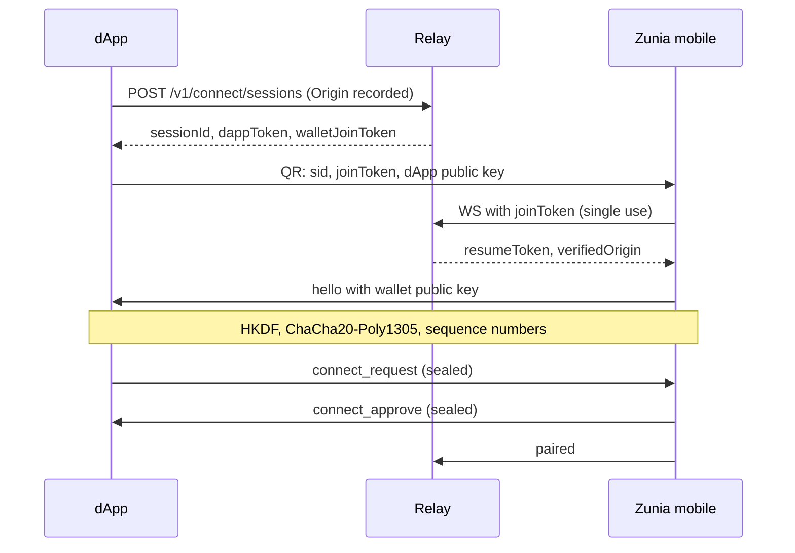

# Connect a phone by QR

A page and Zunia mobile pair through `zunia.connect.v2`. The relay only forwards ciphertext. Both screens show the same 6-digit code so the user can see they are talking to each other.

Zunia does not host a public relay. Run [zunia-backend](https://github.com/Zunia-Lab/zunia-backend) (`pnpm dev` on `http://localhost:8788`) and pass that URL as `apiBase`.

```ts
import { createZuniaSession, renderQrSvg } from "@zunialab/sdk-web";

const session = createZuniaSession();

session.on("pairing", ({ uri }) => {
  dialog.innerHTML = renderQrSvg(uri, { size: 240, label: "Scan with Zunia" });
});
session.on("verification", (code) => {
  dialog.textContent = `Your phone should show ${code.slice(0, 3)} ${code.slice(3)}`;
});

await session.connect({
  chains: ["cosmoshub-4"],
  prefer: "native-ws",
  apiBase: "http://localhost:8788",
  metadata: { name: "My dApp", url: location.origin },
});
```

On React, `ConnectPairingModal` does this. On a phone browser it also offers a `zunia://connect?...` link so the user does not have to scan their own screen.

An unscanned code expires after 10 minutes. After the wallet sends `paired`, the room lasts 24 hours.

## What travels



The QR holds a one-time `walletJoinToken` and the dApp public key. The `dappToken` never goes in the QR. Application frames are opaque to the relay. The protocol is in [zunia.connect.v2](../reference/connect-v2.md).

## Verified origin

When the page creates the session, the relay stores the browser `Origin` header as `verifiedOrigin` and gives it to the wallet. The phone shows that origin. If the dApp's metadata URL is a different site, the wallet warns ("This site is not where it says") and refuses sign-in.

`verifiedOrigin` is only as trustworthy as the relay. A relay you do not control can invent one. Zunia mobile therefore only opens pairing URIs whose relay is on its **trusted list** (`wss://api.zunialab.com` by default, plus `ZUNIA_CONNECT_TRUSTED_RELAYS` and, in debug builds, localhost). A QR that names any other relay is refused.

Point `apiBase` at a relay you run and that the wallet trusts. Do not send users a QR for a relay you do not operate.

## After a reload

`session.restore({ apiBase, chains })` reopens the WebSocket with the stored dApp token and session keys. The wallet uses its `resumeToken`. Counters keep going, so a replayed frame is ignored.

## Deep links

| Kind | Example |
|------|---------|
| Custom scheme | `zunia://connect?…` |
| Universal / App Link | `https://zunialab.com/connect?…` or `https://link.zunialab.com/connect?…` |

Those HTTPS links need the site's `apple-app-site-association` and `assetlinks.json` filled in (team id and Play signing cert) before a store build.
