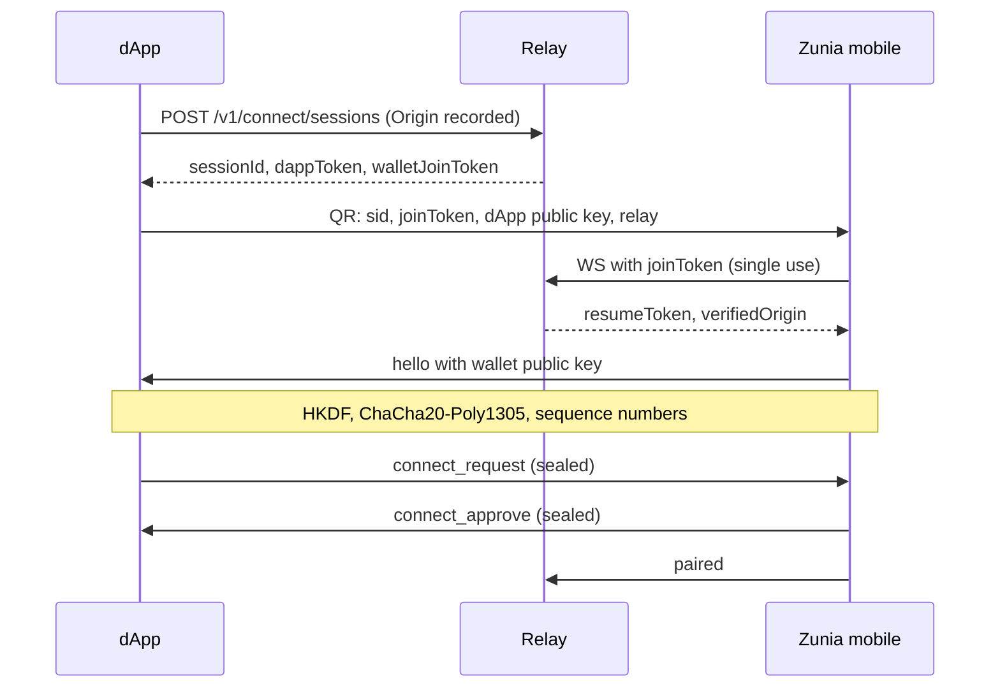

# Connect a phone by QR

A page and Zunia mobile pair through `zunia.connect.v2`. The relay only forwards ciphertext. Both screens show the same 6-digit code so the user can see they are talking to each other.

Zunia runs the relay at `https://api.zunialab.com`. Pass it as `apiBase`. Any site may open sessions there, within per-address rate limits. Its source is [zunia-backend](https://github.com/Zunia-Lab/zunia-backend).

```ts
import { createZuniaSession, renderQrSvg } from "@zunialab/sdk-web";

const session = createZuniaSession();

session.on("pairing", ({ uri }) => {
  dialog.innerHTML = renderQrSvg(uri, { size: 240, label: "Scan with Zunia" });
});
session.on("verification", (code) => {
  dialog.textContent = `Your phone should show ${code.slice(0, 3)} ${code.slice(3)}`;
});

await session.connect({
  chains: ["cosmoshub-4"],
  prefer: "native-ws",
  apiBase: "https://api.zunialab.com",
  metadata: { name: "My dApp", url: location.origin },
});
```

On React, `ConnectPairingModal` does this. On a phone browser it also offers a `zunia://connect?...` link so the user does not have to scan their own screen.

An unscanned code expires after 10 minutes. After the wallet sends `paired`, the room lasts 24 hours.

## What travels


```mermaid
sequenceDiagram
  participant Dapp as dApp
  participant Relay as Relay
  participant Wallet as Zunia mobile
  Dapp->>Relay: POST /v1/connect/sessions (Origin recorded)
  Relay-->>Dapp: sessionId, dappToken, walletJoinToken
  Dapp->>Wallet: QR: sid, joinToken, dApp public key, relay
  Wallet->>Relay: WS with joinToken (single use)
  Relay-->>Wallet: resumeToken, verifiedOrigin
  Wallet->>Dapp: hello with wallet public key
  Note over Dapp,Wallet: HKDF, ChaCha20-Poly1305, sequence numbers
  Dapp->>Wallet: connect_request (sealed)
  Wallet->>Dapp: connect_approve (sealed)
  Wallet->>Relay: paired
```

The QR holds a one-time `walletJoinToken`, the dApp public key and the relay address. The `dappToken` never goes in the QR. Application frames are opaque to the relay. The protocol is in [zunia.connect.v2](../reference/connect-v2.md).

## Verified origin

When the page creates the session, the relay stores the browser `Origin` header as `verifiedOrigin` and gives it to the wallet. The phone shows that origin. If the dApp's metadata URL is a different site, the wallet warns ("This site is not where it says") and refuses sign-in.

`verifiedOrigin` is only as trustworthy as the relay. A relay you do not control can invent one. Zunia mobile therefore only opens pairing URIs whose relay is on its **trusted list**: `wss://api.zunialab.com` by default, plus relays added at build time (`ZUNIA_CONNECT_TRUSTED_RELAYS`, `CONNECT_WS_PUBLIC_URL`) and, in debug builds, relays on the same machine or local network. A QR that names any other relay is refused.

So pass `apiBase: "https://api.zunialab.com"`. A relay you run yourself only pairs with a debug build of Zunia mobile, or with one you built with that relay on its list.

## After a reload

`session.restore({ apiBase, chains })` reopens the WebSocket with the stored dApp token and session keys. The wallet uses its `resumeToken`. Counters keep going, so a replayed frame is ignored.

## Deep links

| Kind | Example |
|------|---------|
| Custom scheme | `zunia://connect?…` |
| Universal / App Link | `https://zunialab.com/connect?…` or `https://link.zunialab.com/connect?…` |

Those HTTPS links do not open the app yet: the `apple-app-site-association` and `assetlinks.json` files on zunialab.com and link.zunialab.com still hold placeholders for the Apple team id and the Play signing certificate. Use the `zunia://` link.
