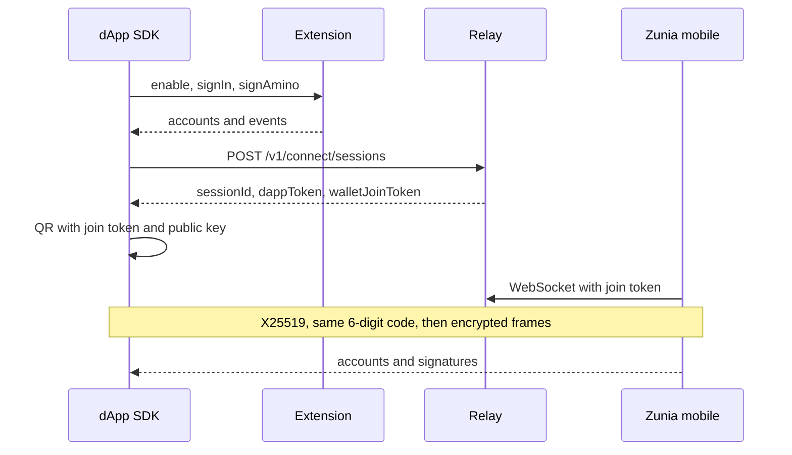

# How Zunia works

Zunia is a non-custodial Cosmos wallet. Keys stay on the device that created or imported them. A dApp never sees a seed phrase. It asks the wallet for addresses, signatures, and live account events.

There are two products you can install, and three ways a site can reach a wallet:

| Product | What it is | Status |
|---------|------------|--------|
| [Browser extension](https://github.com/Zunia-Lab/zunia-extension) | Chrome, Edge, Firefox and Safari (macOS and iOS) | Builds exist. Not in any store yet. |
| [Mobile wallet](https://github.com/Zunia-Lab/zunia-mobile) | iOS and Android | Builds exist. Not in any store yet. WalletConnect sessions are accepted; WalletConnect signing is not implemented. |

A website talks to those products through the [JavaScript SDKs](./get-started/quickstart.md):

1. **Extension.** The wallet injects `window.zunia`. This is the path to use in a desktop browser when Zunia is installed.
2. **Phone, by QR code.** The site shows a code, Zunia mobile scans it, and both sides talk through a relay. Messages are encrypted end to end. Zunia does not host a public relay yet; you run [zunia-backend](https://github.com/Zunia-Lab/zunia-backend) yourself.
3. **WalletConnect v2.** For other wallets. Do not use this to reach Zunia mobile until that app signs WalletConnect requests.

## What you can do today

- Create or import a wallet in the extension or the mobile app, on the same recovery phrase if you want both.
- Connect a web dApp to the extension, restore the session after a reload, and hear account switches, locks and revocations live.
- Sign in with no transaction: the wallet signs a message bound to your site, and your server checks it with `verifySignIn`.
- Sign Amino and Direct transactions and broadcast them yourself (CosmJS or your own client).
- Pair Zunia mobile with a site over QR when you run the relay.
- Send, swap, stake and vote from the extension itself, using the WebAssembly kernel.

## What is not ready

- Store listings (Chrome Web Store, Edge Add-ons, Firefox AMO, App Store, Play Store).
- A hosted Zunia relay. QR pairing needs a relay you run.
- A Flutter SDK for mobile dApps. The existing `zunia_sdk` package is deep links and a button. The v2 client is planned.
- WalletConnect signing in Zunia mobile.
- Hardware wallets (Ledger, Keystone).
- A public web dashboard. The dashboard repo is a scaffold, and it must never receive a seed phrase.
- An independent security audit. None has been completed.

## Next

- [Connect a site in five minutes](./get-started/quickstart.md)
- [Browser and mobile status](./get-started/compatibility.md)
- [Use the wallet](./use-wallet/extension.md)

Need help? Email [dev@zunialab.com](mailto:dev@zunialab.com). For vulnerabilities, write [security@zunialab.com](mailto:security@zunialab.com) instead of opening a public issue.
